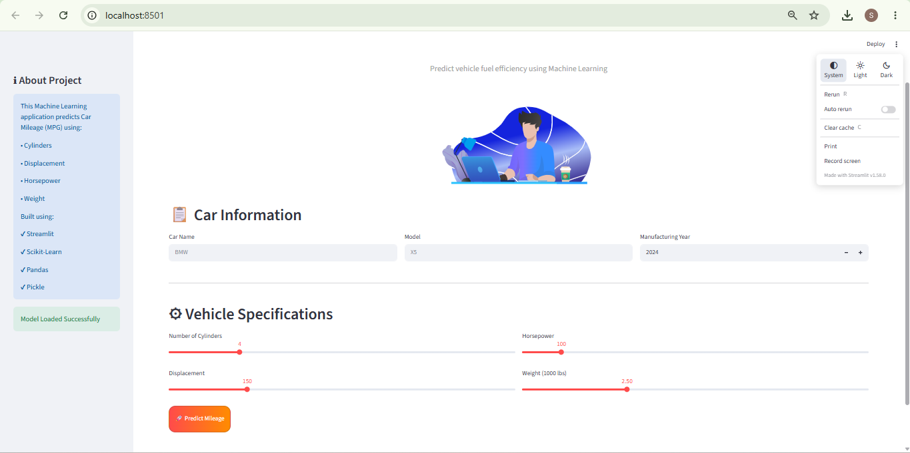
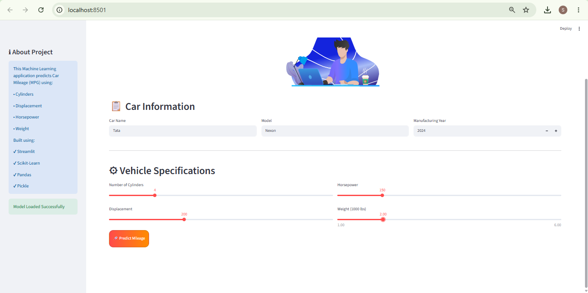
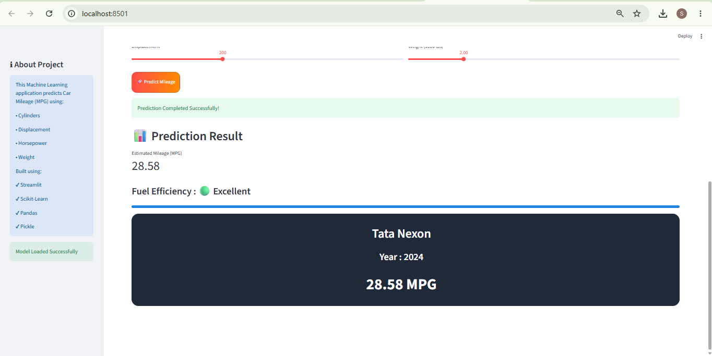

# 🚗 Car Mileage Predictor

An interactive Machine Learning web application that predicts a car's fuel efficiency (Miles Per Gallon - MPG) based on vehicle specifications. Built using Python, Scikit-Learn, Streamlit, and a trained Machine Learning model stored in a Pickle file.

---

## 📌 Project Overview

The Car Mileage Predictor helps users estimate a vehicle's mileage by entering key automobile specifications.

The model predicts MPG using the following features:

* Cylinders (`cyl`)
* Displacement (`disp`)
* Horsepower (`hp`)
* Weight (`wt`)

The application provides a modern user interface with animations, interactive sliders, and real-time predictions.

---

## ✨ Features

### 🚘 Car Information

Users can enter:

* Car Name
* Model Name
* Manufacturing Year

### ⚙ Vehicle Specifications

Users can provide:

* Number of Cylinders
* Engine Displacement
* Horsepower
* Vehicle Weight

### 🤖 Machine Learning Prediction

The trained model predicts:

* Estimated Mileage (MPG)

### 📊 Fuel Efficiency Rating

Based on predicted mileage:

| MPG Range | Rating    |
| --------- | --------- |
| 28+       | Excellent |
| 22 – 27   | Good      |
| 16 – 21   | Average   |
| Below 16  | Poor      |

### 🎨 Modern UI

* Streamlit Interface
* Interactive Sliders
* Car Animation
* Progress Indicators
* Responsive Design
* Attractive Dashboard Layout

---

## 🛠 Tech Stack

### Programming Language

* Python

### Libraries

* Streamlit
* Pandas
* NumPy
* Scikit-Learn
* Pickle
* Requests
* Streamlit-Lottie

### Machine Learning

* Regression Model

---

## 📂 Project Structure

```bash
Car-Mileage-Predictor/
│
├── app.py
├── car_milege_pred.pkl
├── requirements.txt
├── README.md
│
└── Screenshots/
    ├── home_page.png
    ├── prediction_page.png
    └── result_page.png
```

---

## 🚀 Installation

### Clone Repository

```bash
git clone https://github.com/your-username/Car-Mileage-Predictor.git
```

### Navigate to Project Folder

```bash
cd Car-Mileage-Predictor
```

### Install Dependencies

```bash
pip install -r requirements.txt
```

### Run Application

```bash
streamlit run app.py
```

---

## 📈 Model Input Features

| Feature | Description         |
| ------- | ------------------- |
| cyl     | Number of Cylinders |
| disp    | Engine Displacement |
| hp      | Horsepower          |
| wt      | Vehicle Weight      |

---

## 🎯 Example Prediction

### Input

```text
Car Name: BMW
Model: X5
Year: 2024

Cylinders: 6
Displacement: 258
Horsepower: 335
Weight: 4.2
```

### Output

```text
Predicted Mileage: 23.81 MPG
Fuel Efficiency: Good
```

---

## 📸 Screenshots

### Home Page



### Prediction Page



### Result Page



---

## 🔮 Future Enhancements

* Mileage Gauge Meter
* PDF Report Generation
* Prediction History
* Cloud Deployment
* Fuel Cost Estimation
* Vehicle Comparison Tool
* Dark / Light Theme Toggle
* User Authentication

---

## 📊 Machine Learning Workflow

1. Data Collection
2. Data Preprocessing
3. Feature Selection
4. Model Training
5. Model Evaluation
6. Model Serialization using Pickle
7. Streamlit Deployment

---

## 👨‍💻 Author

**Sanket More**
